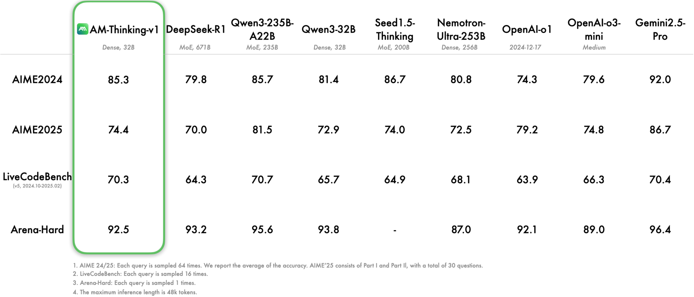
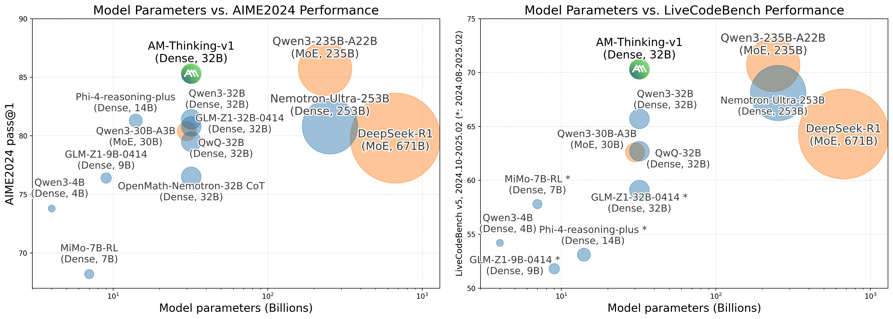
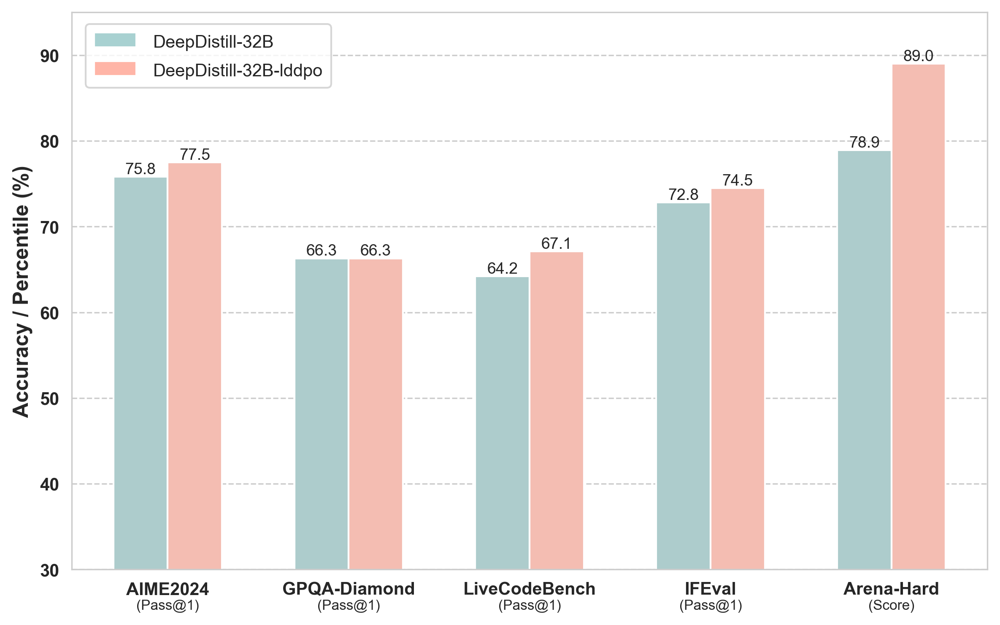
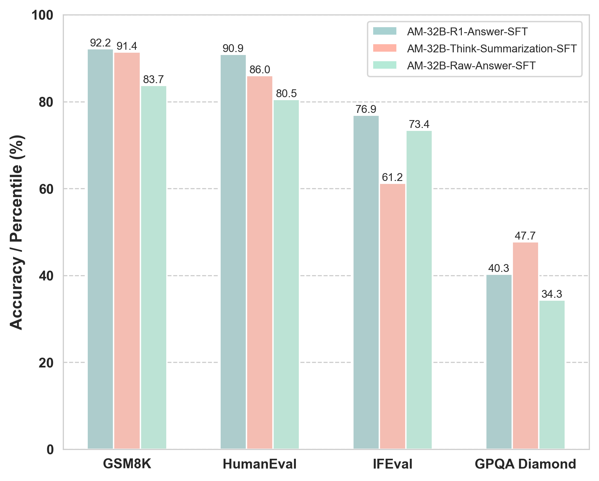
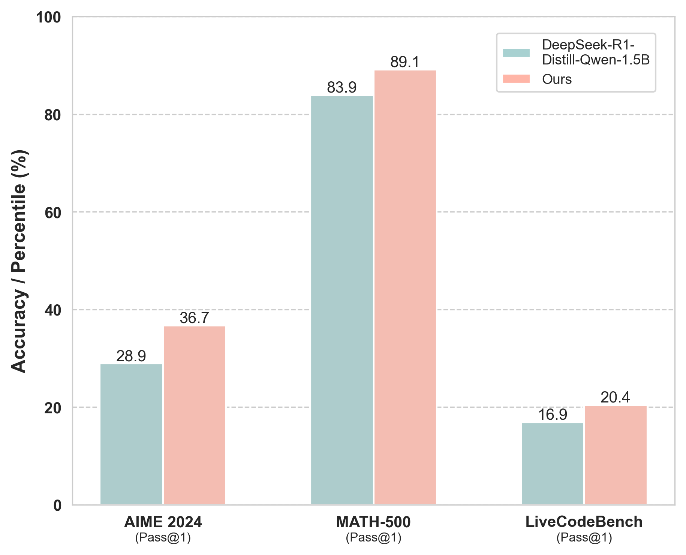
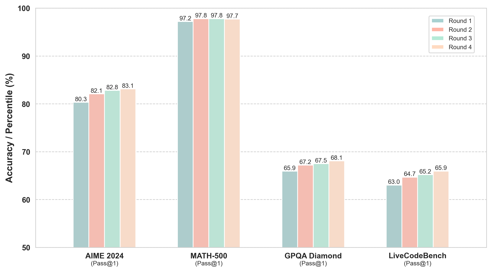

#  a-m-models [](https://huggingface.co/a-m-team)

*Read this in [English](README_en.md).*

a-m-models 是由 a-m-teams 发起的一个开源项目，致力于对大语言模型（LLMs）以及通用人工智能（AGI）的前沿技术进行深入探索与实践。我们的团队由一群充满热情的研究人员和开发者组成，聚焦于大模型的理论创新、架构设计以及实战应用，旨在逐步逼近通用人工智能（AGI）的实现。本项目旨在开源分享我们在大模型领域的最新研究成果与实践经验，希望能够推动社区对AGI技术的深度交流与共同进步。 

## 🔄 最近更新

* [2025-05-20] 发布技术报告[Not All Correct Answers Are Equal: Why Your Distillation Source Matters](https://github.com/a-m-team/a-m-models/blob/main/docs/Not%20All%20Correct%20Answers%20Are%20Equal-%20Why%20Your%20Distillation%20Source%20Matters.pdf)，对比AM-Thinking-v1、Qwen3-235B-A22B与DeepSeek-R1三个模型蒸馏效果，基于AM-Thinking-v1蒸馏训练效果最优，同时分析发现可以根据问题难度调整输出长度。AM-Thinking-v1与Qwen3-235B-A22B两份蒸馏数据已开源。

* [2025-05-14] 发布技术报告[AM-Thinking-v1: Advancing the Frontier of
Reasoning at 32B Scale](https://arxiv.org/pdf/2505.08311)，结合监督微调与强化学习显著提升模型推理能力，在数学与编程任务上超越 DeepSeek-R1，逼近主流 MoE 模型效果，取得 Dense 32B 开源最优水平。

* [2025-05-05] 发布技术报告[Exploring the Potential of Offline RL for Reasoning in
LLMs: A Preliminary Study](https://arxiv.org/abs/2505.02142)，探索了Offline-RL增强模型推理能力的方法，实验结果表明在各项评估指标有一致提升。

* [2025-04-24] 发布技术报告[DeepDistill: Enhancing LLM Reasoning Capabilities via Large-Scale Difficulty-Graded Data Training](https://arxiv.org/abs/2504.17565)，开源了约4000万条不同能力模型的蒸馏数据集，显著提升基础模型推理能力。

* [2025-04-13] 更新技术报告[Leveraging Reasoning Model Answers to Enhance Non-Reasoning
Model Capability](https://arxiv.org/pdf/2504.09639)，探索了使用reasoning model提升non-reasoning model表现的方法。

* [2025-04-01] 更新技术报告 [How Difficulty-Aware Staged Reinforcement Learning Enhances LLMs' Reasoning Capabilities: A Preliminary Experimental Study](https://github.com/a-m-team/a-m-models/blob/main/docs/How-Difficulty-Aware-Staged-Reinforcement-Learning-Enhances-LLMs-Reasoning-Capabilities-A-Preliminary-Experimental-Study.pdf)，介绍了一种分阶段训练方法，逐步让模型接触更具挑战性的任务，从而提高其推理能力

* [2025-03-25] 更新技术报告[1.4 Million Open-Source Distilled Reasoning Dataset to Empower Large Language Model Traning](https://github.com/a-m-team/a-m-models/blob/main/docs/AM-DeepSeek-R1-Distilled-Dataset.pdf)，开源140万条蒸馏推理数据，复现DeepSeek-R1蒸馏模型效果

* [2025-03-25] 更新技术报告[Think Twice: Enhancing LLM Reasoning by Scaling Multi-round Test-time Thinking](https://github.com/a-m-team/a-m-models/blob/main/docs/Think-Twice.pdf)，介绍了一种简单且有效的测试阶段扩展方法——多轮思考，其推动了SOTA模型效果的进一步提升

## 📑 研究报告

### [Not All Correct Answers Are Equal: Why Your Distillation Source Matters](https://github.com/a-m-team/a-m-models/blob/main/docs/Not%20All%20Correct%20Answers%20Are%20Equal-%20Why%20Your%20Distillation%20Source%20Matters.pdf) [](https://huggingface.co/datasets/a-m-team/AM-Thinking-v1-Distilled) [](https://huggingface.co/datasets/a-m-team/AM-Qwen3-Distilled)

基于AM-Thinking-v1、Qwen3-235B-A22B以及DeepSeek-R1蒸馏了三份推理数据。实验发现基于AM-Thinking-v1蒸馏效果最优，其中**AIME2024 84.3，AIME 2025 72.2, MATH500 98.4, LiveCodeBench 65.9**.


实验发现基于AM-Thinking-v1蒸馏训练的模型，相较Qwen3-235B-A22B蒸馏训练的模型在较简单任务(如MATH500)推理长度更短，在较难任务(如AIME2024 & 2025、LiveCodeBench)推理输出更长。其中基于AM-Thinking-v1与Qwen3-235B-A22B蒸馏数据已开源。

#### Table: Average generation length (tokens per sample) across reasoning benchmarks

| Benchmark        | AM-Thinking-v1<sub>Distilled</sub> | Qwen3-235B-A22B<sub>Distilled</sub> | DeepSeek-R1<sub>Distilled</sub> |
|------------------|-------------------------------------|--------------------------------------|----------------------------------|
| AIME2024         | 15273.8                            | 13516.4                              | 11853.5                          |
| AIME2025         | 18199.2                            | 16975.7                              | 13495.9                          |
| MATH500          | 3495.7                             | 6429.4                               | 3613.0                           |
| LiveCodeBench    | 23426.9                            | 13576.7                              | 30731                            |


### [AM-Thinking-v1: Advancing the Frontier of Reasoning at 32B Scale](https://arxiv.org/pdf/2505.08311)[](https://huggingface.co/a-m-team/AM-Thinking-v1)

当前大多数在推理能力上表现突出的开源语言模型多采用Mixture-of-Experts（MoE）架构，如 Qwen3-235B-A22B 和 Seed1.5-Thinking，尽管在性能上具备优势，但其部署和微调成本较高，不易应用于资源受限场景。相比之下，稠密结构的中等规模模型（如32B）在性能与实用性之间提供了更好的平衡，但相关工作仍相对较少。

基于这一动机，我们构建了 **AM-Thinking-v1**. 该模型使用公开数据，通过有监督微调与强化学习相结合的后训练流程优化推理与代码能力。



实验结果显示，AM-Thinking-v1 在多个基准测试中表现优异：**AIME 2024 得分 85.3，AIME 2025 得分 74.4，LiveCodeBench 得分 70.3**，超过 DeepSeek-R1，并接近 MoE 架构的最强模型，是当前Dense 32B最优模型。结果表明，得益于精细的训练流程，32B 规模的开源稠密模型亦可在高难度推理任务中实现竞争性能。




### [Exploring the Potential of Offline RL for Reasoning inLLMs: A Preliminary Study](https://github.com/a-m-team/a-m-models/blob/main/docs/Exploring-the-Potential-of-Offline-RL-for-Reasoning-in-LLMs-A-Preliminary-Study.pdf)

随着大语言模型（LLMs）在长上下文推理任务中的表现持续提升，当前的主流方法主要依赖在线强化学习（Online RL），然而这些方法通常伴随较高的计算成本和复杂性。相较而言，离线强化学习（Offline RL）方法因其简洁高效而展现出潜在的优势，但在长上下文推理领域却未获得充分探索。

针对这一研究空白，本论文探讨了Offline RL方法，尤其是直接偏好优化（Direct Preference Optimization, DPO）及其对输出长度不敏感的变体LD-DPO，在提升LLMs推理能力上的有效性。我们通过广泛的实验，在多个推理基准上验证了这些更为简洁的Offline RL方法能够显著提高模型性能，平均提升达到**3.3%**，其中arena-hard基准测试中提升达到**10.1%**。

此外，本研究分析了DPO方法对于输出长度的敏感性，强调在延长推理文本长度时需要关注内容的语义丰富性，而非盲目增加长度，否则可能会对模型性能产生负面影响。




### [DeepDistill: Enhancing LLM Reasoning Capabilities via Large-Scale Difficulty-Graded Data Training](https://arxiv.org/abs/2504.17565)[](https://huggingface.co/datasets/a-m-team/AM-DeepSeek-Distilled-40M)

尽管近期大语言模型（LLMs）在复杂推理任务中取得了显著的进展，但对基础模型的训练过程和数据质量的深入理解仍然不足。为解决此问题，我们构建了一个包含约**334万**个不重复问题和**4000万**条由不同能力模型多次蒸馏答案的大规模推理数据集。通过引入通过率（Pass Rate）和变异系数（Coefficient of Variation），我们精准选择具有最高学习潜力的训练数据，以提升推理能力。该数据集已公开在 <https://huggingface.co/datasets/a-m-team/AM-DeepSeek-Distilled-40M>。

在AIME2024上，我们的72B模型**仅通过SFT**达到了79.2分；32B模型达到75.8分，进一步退火训练达到77.9分，接近开源最优水平。


### [Leveraging Reasoning Model Answers to Enhance Non-Reasoning Model Capability](https://arxiv.org/pdf/2504.09639)

近期大型语言模型（LLMs）的进展，例如 DeepSeek-R1 和 OpenAI-o1，已展示了test time scaling的显著有效性，在各种基准测试中取得了实质性的性能提升。这些先进模型利用审慎的"思考"步骤系统地提高答案质量。在本文中，我们提出利用这些由reasoning model生成的高质量输出，来改进计算需求较低、非推理的模型。我们探索并比较了利用推理模型产生的答案来训练和改进非推理模型的方法。通过在既定基准上进行监督微调（SFT）实验，我们在各种基准上取得了持续的改进，强调了这种方法在提升non-reasoning model直接回答问题的能力方面的潜力。

1. **方法**: 对比了三种利用reasoning-model内容的方法:
   - **方法1**: 使用原生的non-reasoning model产生的回答；
   - **方法2**: 使用reasoning model的'answer'部分；
   - **方法3**: think summarization: 总结reasoning model 的think 部分 和 answer部分拼在一起。

2. **结论**: 正确使用reasoning model的回复内容可以增强non-reasoning model的能力，具体效果如图所示。然而，若方法不当，可能导致模型的某些指标下降。因此，在使用过程中需要根据不同场景采用特定策略来提升non-reasoning model的能力。




### [How Difficulty-Aware Staged Reinforcement Learning Enhances LLMs' Reasoning Capabilities: A Preliminary Experimental Study](https://github.com/a-m-team/a-m-models/blob/main/docs/How-Difficulty-Aware-Staged-Reinforcement-Learning-Enhances-LLMs-Reasoning-Capabilities-A-Preliminary-Experimental-Study.pdf)[](https://huggingface.co/datasets/a-m-team/AM-Math-Difficulty-RL)

提高大语言模型（LLMs）推理能力的效率和规模是人工智能研究中的一个关键挑战。本文研究了难度感知分阶段强化学习（RL）策略如何提升LLM性能。我们表明，基于难度等级选择训练数据有助于强化学习优化。此外，我们提出了一种分阶段训练方法，逐步让模型接触更具挑战性的任务，从而提高其推理能力。我们的结果还强调了在数学推理和代码生成任务上训练模型的显著好处。

#### 1. 数据难度选择

根据适当的难度指标精心选择RL训练数据至关重要。适中的难度水平能够提高学习效率，平衡充分挑战与避免用过于困难的情境压倒学习过程之间的需求。


#### 2. 分阶段训练

通过选择适当具有挑战性的数据并结合分阶段训练，我们可以显著提高LLM在推理任务上的表现。（由于没加入与代码相关的训练数据，模型在LiveCodeBench上的表现与基础模型基本相同。）


#### 3. 数学和代码的同时训练

在训练过程中混合数学推理和代码生成任务可以带来跨领域的提升，强有力地证明了多领域训练的好处。



### [Think Twice: Enhancing LLM Reasoning by Scaling Multi-round Test-time Thinking](https://github.com/a-m-team/a-m-models/blob/main/docs/Think-Twice.pdf)

近年来，以OpenAI-o1和DeepSeek-R1为代表的大语言模型（LLMs）取得了显著进展，这些进展表明，通过测试阶段扩展推理流程（test-time scaling），可显著提升模型表现。然而，目前的模型仍受到处理长文本能力和强化学习（RL）训练效率的限制。为解决这些问题，我们提出了一种简单且有效的测试阶段扩展方法——多轮思考（Multi-round Thinking）。该方法通过将模型先前的回答作为下一轮推理的提示（prompts），迭代地精进模型的推理过程。在包括QwQ-32B和DeepSeek-R1在内的多个模型上的大量实验表明，多轮思考能够在AIME 2024、MATH-500、GPQA-diamond和LiveCodeBench等多个基准测试中稳定提升模型表现。例如，在AIME 2024数据集中，QwQ-32B的准确率从第一轮的80.3%提高到第二轮的82.1%，DeepSeek-R1也表现出了类似的提升，从79.7%提高到82.0%。这些结果证明，多轮思考是一种适用广泛、实施简单且有效提升模型表现的方法，彰显出该方法在未来测试阶段扩展技术发展中的巨大潜力。

The key prompt:
```
Original question prompt
The assistant’s previous answer is: <answer> last round answer </answer>, and please re-answer.
```




### 不同基准测试中单轮思考（第1轮）与多轮思考（第2-4轮）的模型表现对比（pass@1）

| **Model**                              | **Round** | **AIME 2024 pass@1** | **MATH500 pass@1** | **GPQA-Diamond pass@1** | **LiveCodeBench pass@1** | **Average** |
|----------------------------------------|-----------|----------------------|--------------------|-------------------------|--------------------------|-------------|
| **Deepseek-R1**                        | 1         | 79.7                 | 97.6               | 74.0                    | 65.3                     | 79.2        |
|                                        | **2**     | **82.0**             | **97.6**           | **74.8**                | **67.1**                 | **80.4**    |
| **QwQ-32B**                            | 1         | 80.3                 | 97.2               | 65.9                    | 63.0                     | 76.6        |
|                                        | 2         | 82.1                 | 97.8               | 67.2                    | 64.7                     | 78.0        |
|                                        | 3         | 82.8                 | 97.8               | 67.5                    | 65.2                     | 78.3        |
|                                        | **4**     | **83.1**             | **97.7**           | **68.1**                | **66.0**                 | **78.7**    |
| **DeepSeek-R1-Distill-Qwen-32B**       | 1         | 72.0                 | 96.0               | 60.1                    | 57.0                     | 71.3        |
|                                        | **2**     | **75.1**             | **96.3**           | **61.3**                | **57.6**                 | **72.6**    |
| **DeepSeek-R1-Distill-Qwen-7B**        | 1         | 56.9                 | 93.4               | 49.2                    | 35.0                     | 58.6        |
|                                        | **2**     | **58.4**             | **93.9**           | **49.4**                | **36.7**                 | **59.6**    |
| **AM-Distill-Qwen-32B**                | 1         | 72.8                 | 96.2               | 62.3                    | 58.3                     | 72.4        |
|                                        | **2**     | **76.7**             | **97.2**           | **62.8**                | **60.2**                 | **74.2**    |

---
---

### [1.4 Million Open-Source Distilled Reasoning Dataset to Empower Large Language Model Traning](https://github.com/a-m-team/a-m-models/blob/main/docs/AM-DeepSeek-R1-Distilled-Dataset.pdf) [](https://huggingface.co/datasets/a-m-team/AM-DeepSeek-R1-Distilled-1.4M)

AM-DeepSeek-R1-Distilled 是一个大规模、带有推理过程的通用推理任务数据集，包含大量高质量且具备挑战性的推理问题。这些问题收集自多个开源数据集，经过语义去重和精细清理，以消除可能的测试集污染风险。数据集中所有的答案均由推理模型（主要为 DeepSeek-R1）蒸馏而成，并经过严格的验证流程：数学问题通过与标准答案对比进行验证，代码问题通过测试用例进行核验，而其他类型任务则通过奖励模型进行评估。基于该数据集仅使用简单监督微调（SFT）训练的 AM-Distill-Qwen-32B 模型，在 AIME2024、MATH-500、GPQA-Diamond 以及 LiveCodeBench 四项基准测试上，均超越了DeepSeek-R1-Distill-Qwen-32B 模型。为了推动更强大的推理导向大语言模型（LLMs）发展，我们开源了这140万条问题及其对应的答案。该数据集已公开在 <https://huggingface.co/datasets/a-m-team/AM-DeepSeek-R1-Distilled-1.4M。>


## Citation

如果您觉得我们的工作对您的研究有所帮助，欢迎给我们点个星 :star:, 并引用我们的工作:pencil:

```BibTeX
@misc{ji2025amthinkingv1advancingfrontierreasoning,
      title={AM-Thinking-v1: Advancing the Frontier of Reasoning at 32B Scale}, 
      author={Yunjie Ji and Xiaoyu Tian and Sitong Zhao and Haotian Wang and Shuaiting Chen and Yiping Peng and Han Zhao and Xiangang Li},
      year={2025},
      eprint={2505.08311},
      archivePrefix={arXiv},
      primaryClass={cs.CL},
      url={https://arxiv.org/abs/2505.08311}, 
}

@misc{tian2025exploringpotentialofflinerl,
      title={Exploring the Potential of Offline RL for Reasoning in LLMs: A Preliminary Study}, 
      author={Xiaoyu Tian and Sitong Zhao and Haotian Wang and Shuaiting Chen and Yiping Peng and Yunjie Ji and Han Zhao and Xiangang Li},
      year={2025},
      eprint={2505.02142},
      archivePrefix={arXiv},
      primaryClass={cs.CL},
      url={https://arxiv.org/abs/2505.02142}, 
}

@misc{tian2025deepdistillenhancingllmreasoning,
      title={DeepDistill: Enhancing LLM Reasoning Capabilities via Large-Scale Difficulty-Graded Data Training}, 
      author={Xiaoyu Tian and Sitong Zhao and Haotian Wang and Shuaiting Chen and Yiping Peng and Yunjie Ji and Han Zhao and Xiangang Li},
      year={2025},
      eprint={2504.17565},
      archivePrefix={arXiv},
      primaryClass={cs.CL},
      url={https://arxiv.org/abs/2504.17565}, 
}

@misc{wang2025leveragingreasoningmodelanswers,
      title={Leveraging Reasoning Model Answers to Enhance Non-Reasoning Model Capability}, 
      author={Haotian Wang and Han Zhao and Shuaiting Chen and Xiaoyu Tian and Sitong Zhao and Yunjie Ji and Yiping Peng and Xiangang Li},
      year={2025},
      eprint={2504.09639},
      archivePrefix={arXiv},
      primaryClass={cs.CL},
      url={https://arxiv.org/abs/2504.09639}, 
}

@misc{ji2025difficultyawarestagedreinforcementlearning,
      title={How Difficulty-Aware Staged Reinforcement Learning Enhances LLMs' Reasoning Capabilities: A Preliminary Experimental Study}, 
      author={Yunjie Ji and Sitong Zhao and Xiaoyu Tian and Haotian Wang and Shuaiting Chen and Yiping Peng and Han Zhao and Xiangang Li},
      year={2025},
      eprint={2504.00829},
      archivePrefix={arXiv},
      primaryClass={cs.CL},
      url={https://arxiv.org/abs/2504.00829}, 
}

@misc{tian2025thinktwiceenhancingllm,
      title={Think Twice: Enhancing LLM Reasoning by Scaling Multi-round Test-time Thinking}, 
      author={Xiaoyu Tian and Sitong Zhao and Haotian Wang and Shuaiting Chen and Yunjie Ji and Yiping Peng and Han Zhao and Xiangang Li},
      year={2025},
      eprint={2503.19855},
      archivePrefix={arXiv},
      primaryClass={cs.CL},
      url={https://arxiv.org/abs/2503.19855}, 
}

@misc{zhao202514millionopensourcedistilled,
      title={1.4 Million Open-Source Distilled Reasoning Dataset to Empower Large Language Model Training}, 
      author={Han Zhao and Haotian Wang and Yiping Peng and Sitong Zhao and Xiaoyu Tian and Shuaiting Chen and Yunjie Ji and Xiangang Li},
      year={2025},
      eprint={2503.19633},
      archivePrefix={arXiv},
      primaryClass={cs.CL},
      url={https://arxiv.org/abs/2503.19633}, 
}


```
