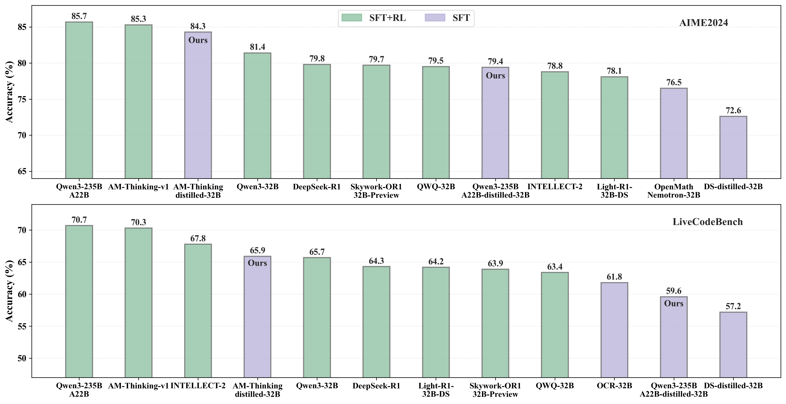

#  a-m-models [](https://huggingface.co/a-m-team)

*[中文README](README.md).*

a-m-models is an open-source initiative led by the a-m-team, dedicated to in-depth exploration and practical application of cutting-edge technologies in Large Language Models (LLMs) and Artificial General Intelligence (AGI). Our team, composed of passionate researchers and developers, focuses on theoretical innovation, architectural design, and practical deployment of large models, aiming to gradually approach the realization of AGI. This project aims to openly share our latest research results and practical experiences in the domain of large models, fostering deeper community exchanges and mutual advancement in AGI technology.

## 🔄 Recent Updates

* [2025-05-20] Published the technical report [Not All Correct Answers Are Equal: Why Your Distillation Source Matters](https://github.com/a-m-team/a-m-models/blob/main/docs/Not%20All%20Correct%20Answers%20Are%20Equal-%20Why%20Your%20Distillation%20Source%20Matters.pdf), comparing the distillation effectiveness of three models: AM-Thinking-v1, Qwen3-235B-A22B, and DeepSeek-R1. The results show that distillation based on AM-Thinking-v1 yields the best performance. The analysis also reveals that output length can be adjusted according to question difficulty. Distillation datasets for AM-Thinking-v1 and Qwen3-235B-A22B have been open-sourced.

* [2025-05-14] Released technical report [AM-Thinking-v1: Advancing the Frontier of Reasoning at 32B Scale](https://arxiv.org/pdf/2505.08311), which significantly improves reasoning capabilities by combining supervised fine-tuning with reinforcement learning. It surpasses DeepSeek-R1 in math and coding tasks and approaches the performance of mainstream MoE models, achieving state-of-the-art results among dense 32B open-source models.

* [2025-05-05] Released technical report [Exploring the Potential of Offline RL for Reasoning in LLMs: A Preliminary Study](https://arxiv.org/abs/2505.02142), investigating methods for enhancing model reasoning capabilities using Offline RL. Experimental results demonstrate consistent improvements across various evaluation metrics.

* [2025-04-24] Released the technical report [DeepDistill: Enhancing LLM Reasoning Capabilities via Large-Scale Difficulty-Graded Data Training](https://arxiv.org/abs/2504.17565) and open-sourced a distilled dataset of approximately 40 million samples generated by models of varying capabilities, significantly enhancing foundational model reasoning performance.

* [2025-04-13] Updated technical report [Leveraging Reasoning Model Answers to Enhance Non-Reasoning
Model Capability](https://arxiv.org/pdf/2504.09639)，We explore and compare methodologies for utilizing the answers produced by reasoning models to train and improve non-reasoning models.

* [2025-04-01] Updated technical report [How Difficulty-Aware Staged Reinforcement Learning Enhances LLMs' Reasoning Capabilities: A Preliminary Experimental Study](https://github.com/a-m-team/a-m-models/blob/main/docs/How-Difficulty-Aware-Staged-Reinforcement-Learning-Enhances-LLMs-Reasoning-Capabilities-A-Preliminary-Experimental-Study.pdf), introduce a staged training approach that gradually exposes models to more challenging tasks, improving their reasoning capabilities.

* [2025-03-25] Updated technical report [1.4 Million Open-Source Distilled Reasoning Dataset to Empower Large Language Model Training](https://github.com/a-m-team/a-m-models/blob/main/docs/AM-DeepSeek-R1-Distilled-Dataset.pdf), open-sourced 1.4 million distilled reasoning data entries, reproducing the performance of DeepSeek-R1 distilled models.

* [2025-03-25] Updated the technical report [Think Twice: Enhancing LLM Reasoning by Scaling Multi-round Test-time Thinking](https://github.com/a-m-team/a-m-models/blob/main/docs/Think-Twice.pdf), introducing a simple yet effective test-time scaling approach—Multi-round Thinking—which further advances the state-of-the-art model performance

## 📑 Research Reports

### [Not All Correct Answers Are Equal: Why Your Distillation Source Matters](https://github.com/a-m-team/a-m-models/blob/main/docs/Not%20All%20Correct%20Answers%20Are%20Equal-%20Why%20Your%20Distillation%20Source%20Matters.pdf) [](https://huggingface.co/datasets/a-m-team/AM-Thinking-v1-Distilled) [](https://huggingface.co/datasets/a-m-team/AM-Qwen3-Distilled)

Three sets of reasoning data were distilled from AM-Thinking-v1, Qwen3-235B-A22B, and DeepSeek-R1. Experiments show that distillation based on AM-Thinking-v1 performs the best, with scores of **AIME2024: 84.3, AIME2025: 72.2, MATH500: 98.4, LiveCodeBench: 65.9**.



The results indicate that models trained via distillation from AM-Thinking-v1 produce shorter reasoning outputs on simpler tasks (e.g., MATH500) and longer outputs on more difficult tasks (e.g., AIME2024 & 2025, LiveCodeBench), compared to those distilled from Qwen3-235B-A22B. The distillation datasets for both AM-Thinking-v1 and Qwen3-235B-A22B have been open-sourced.

#### Table: Average generation length (tokens per sample) across reasoning benchmarks

| Benchmark        | AM-Thinking-v1<sub>Distilled</sub> | Qwen3-235B-A22B<sub>Distilled</sub> | DeepSeek-R1<sub>Distilled</sub> |
|------------------|-------------------------------------|--------------------------------------|----------------------------------|
| AIME2024         | 15,273.8                            | 13,516.4                              | 11,853.5                          |
| AIME2025         | 18,199.2                            | 16,975.7                              | 13,495.9                          |
| MATH500          | 3,495.7                             | 6,429.4                               | 3,613.0                           |
| LiveCodeBench    | 23,426.9                            | 13,576.7                              | 30,731                            |

### [AM-Thinking-v1: Advancing the Frontier of Reasoning at 32B Scale](https://arxiv.org/pdf/2505.08311)[](https://huggingface.co/a-m-team/AM-Thinking-v1)

Most open-source language models that excel in reasoning tasks adopt a Mixture-of-Experts (MoE) architecture, such as Qwen3-235B-A22B and Seed1.5-Thinking. While these models offer strong performance, their deployment and fine-tuning costs are high, making them less suitable for resource-constrained environments. In contrast, medium-sized dense models (e.g., 32B) offer a better balance between performance and practicality, though such efforts remain relatively scarce.

Motivated by this, we developed **AM-Thinking-v1**, a model trained on publicly available data using a post-training pipeline that combines supervised fine-tuning and reinforcement learning to enhance reasoning and coding abilities.


Experimental results show that AM-Thinking-v1 performs strongly across multiple benchmarks: **AIME 2024 score of 85.3, AIME 2025 score of 74.4, and LiveCodeBench score of 70.3** — surpassing DeepSeek-R1 and approaching the top-performing MoE models. This makes it the best dense 32B model currently available. The results demonstrate that with a carefully designed training pipeline, open-source dense models at the 32B scale can also achieve competitive performance on challenging reasoning tasks.


### [Exploring the Potential of Offline RL for Reasoning inLLMs: A Preliminary Study](https://github.com/a-m-team/a-m-models/blob/main/docs/Exploring-the-Potential-of-Offline-RL-for-Reasoning-in-LLMs-A-Preliminary-Study.pdf)

With continuous improvements in the performance of large language models (LLMs) on long-context reasoning tasks, current mainstream approaches primarily rely on online reinforcement learning (Online RL). However, these methods typically entail high computational costs and complexity. In contrast, offline reinforcement learning (Offline RL) methods offer potential advantages due to their simplicity and efficiency but have remained underexplored in the context of long-context reasoning.

Addressing this research gap, our paper explores the effectiveness of Offline RL methods, particularly Direct Preference Optimization (DPO) and its length-desensitized variant LD-DPO, for enhancing the reasoning capabilities of LLMs. Through extensive experiments across multiple reasoning benchmarks, we demonstrate that these simpler Offline RL methods significantly improve model performance, achieving an average enhancement of **3.3%**, with a notable improvement of **10.1%** on the arena-hard benchmark.

Additionally, our study analyzes the sensitivity of the DPO method to output length, emphasizing the necessity of maintaining semantic richness when extending reasoning text, as indiscriminate lengthening may negatively impact model performance.


### [DeepDistill: Enhancing LLM Reasoning Capabilities via Large-Scale Difficulty-Graded Data Training](https://arxiv.org/abs/2504.17565)[](https://huggingface.co/datasets/a-m-team/AM-DeepSeek-Distilled-40M)

Despite recent significant advances in large language models (LLMs) on complex reasoning tasks, the training process and data quality of foundational models remain poorly understood. To address this, we constructed a large-scale reasoning dataset containing approximately **3.34 million** unique questions and **40 million** distilled responses generated multiple times by models with varying capabilities. By introducing metrics such as Pass Rate and Coefficient of Variation, we accurately selected training data with the highest learning potential to enhance reasoning abilities. The dataset was published in <https://huggingface.co/datasets/a-m-team/AM-DeepSeek-Distilled-40M>.

On AIME 2024, our 72B model achieved a score of 79.2 **using only supervised fine-tuning (SFT)**. The 32B model reached 75.8 and improved further to 77.9 through annealing training, approaching state-of-the-art open-source performance.


### [Leveraging Reasoning Model Answers to Enhance Non-Reasoning Model Capability](https://arxiv.org/pdf/2504.09639)

Recent advancements in large language models (LLMs), such as DeepSeek-R1 and OpenAI-o1, have demonstrated the significant effectiveness of test-time scaling, achieving substantial performance gains across various benchmarks. These advanced models utilize deliberate ”thinking” steps to systematically enhance answer quality. In this paper, we propose leveraging these high-quality outputs generated by reasoning-intensive models to improve less computationally demanding, non-reasoning models. We explore and compare methodologies for utilizing the answers produced by reasoning models to train and improve non-reasoning models. Through straightforward Supervised Fine-Tuning (SFT) experiments on established benchmarks, we demonstrate consistent improvements across various benchmarks, underscoring the potential of this approach for advancing the ability of models to answer questions directly.

1. **Approach**: To evaluate different strategies for leveraging reasoning models to generate informative responses, we explored three distinct methods
   - **1.Original Response:**:  This method utilizes the raw response directly from the community dataset,serving as our baseline for comparison
   - **2.Direct Reasoning Model Output (Answer Component):**: This approach uses only the answer component generated directly by reasoning model
   - **3.Think Summarization:**: this method first summarizes the thinking component using the summarization model.This summary capturing the essential problem-solving steps, is then prepended to the reasoning model’s original answer component

2. **Conclusion**: The results presented in this paper affirm that supervised fine-tuning (SFT) using response data derived from reasoning models can significantly enhance the performance of target language models. 


### [How Difficulty-Aware Staged Reinforcement Learning Enhances LLMs' Reasoning Capabilities: A Preliminary Experimental Study](https://github.com/a-m-team/a-m-models/blob/main/docs/How-Difficulty-Aware-Staged-Reinforcement-Learning-Enhances-LLMs-Reasoning-Capabilities-A-Preliminary-Experimental-Study.pdf)[](https://huggingface.co/datasets/a-m-team/AM-Math-Difficulty-RL)


Improving the reasoning abilities of Large Language Models (LLMs) efficiently and at scale is a key challenge in AI research. This paper investigates how difficulty-aware staged reinforcement learning (RL) strategies can boost LLM performance. We show that selecting training data based on difficulty levels enhances RL optimization. Additionally, we propose a staged training approach that gradually exposes models to more challenging tasks, improving their reasoning capabilities. Besides, our results highlight significant benefits when training models on both mathematical reasoning and code generation tasks.

#### 1. Data Difficulty Selection

Carefully selecting RL training data based on appropriate difficulty metrics is critical. A moderate difficulty level enhances learning efficiency, balancing the need for adequate challenge against the risk of overwhelming the learning process with overly difficult scenarios.


#### 2. Staged Training

By selecting appropriately challenging data and incorporating staged training, we can significantly improve the performance of LLMs on reasoning tasks. (Due to the absence of code-related training data, its performance on LiveCodeBench is essentially the same as that of the base model.)


#### 3. Simultaneous Training on Mathematics and Code

Mixing mathematical reasoning and code generation tasks during training results in cross-domain improvements, providing strong evidence for the benefits of multi-domain training.


### [Think Twice: Enhancing LLM Reasoning by Scaling Multi-round Test-time Thinking](https://github.com/a-m-team/a-m-models/blob/main/docs/Think-Twice.pdf)

Recent advances in large language models (LLMs), such as OpenAI-o1 and DeepSeek-R1, have demonstrated the effectiveness of test-time scaling, where extended reasoning processes substantially enhance model performance. Despite this, current models are constrained by limitations in handling long texts and reinforcement learning (RL) training efficiency. To address these issues, we propose a simple yet effective test-time scaling approach—\textbf{Multi-round Thinking}. This method iteratively refines model reasoning by leveraging previous answers as prompts for subsequent rounds. Extensive experiments across multiple models, including QwQ-32B and DeepSeek-R1, consistently show performance improvements on various benchmarks such as AIME 2024, MATH-500, GPQA-diamond, and LiveCodeBench. For instance, the accuracy of QwQ-32B improved from 80.3\% (Round 1) to 82.1\% (Round 2) on the AIME 2024 dataset, while DeepSeek-R1 showed a similar increase from 79.7\% to 82.0\%. These results confirm that \textbf{Multi-round Thinking} is a broadly applicable, straightforward approach to achieving stable enhancements in model performance, underscoring its potential for future developments in test-time scaling techniques.

The key prompt:
```
Original question prompt
The assistant’s previous answer is: <answer> last round answer </answer>, and please re-answer.
```


### Model Performance Comparison (pass@1 accuracy) Between Single-round (Round 1) and Multi-round Thinking (Round 2-4) Across Different Benchmarks

| **Model**                              | **Round** | **AIME 2024 pass@1** | **MATH500 pass@1** | **GPQA-Diamond pass@1** | **LiveCodeBench pass@1** | **Average** |
|----------------------------------------|-----------|----------------------|--------------------|-------------------------|--------------------------|-------------|
| **Deepseek-R1**                        | 1         | 79.7                 | 97.6               | 74.0                    | 65.3                     | 79.2        |
|                                        | **2**     | **82.0**             | **97.6**           | **74.8**                | **67.1**                 | **80.4**    |
| **QwQ-32B**                            | 1         | 80.3                 | 97.2               | 65.9                    | 63.0                     | 76.6        |
|                                        | 2         | 82.1                 | 97.8               | 67.2                    | 64.7                     | 78.0        |
|                                        | 3         | 82.8                 | 97.8               | 67.5                    | 65.2                     | 78.3        |
|                                        | **4**     | **83.1**             | **97.7**           | **68.1**                | **66.0**                 | **78.7**    |
| **DeepSeek-R1-Distill-Qwen-32B**       | 1         | 72.0                 | 96.0               | 60.1                    | 57.0                     | 71.3        |
|                                        | **2**     | **75.1**             | **96.3**           | **61.3**                | **57.6**                 | **72.6**    |
| **DeepSeek-R1-Distill-Qwen-7B**        | 1         | 56.9                 | 93.4               | 49.2                    | 35.0                     | 58.6        |
|                                        | **2**     | **58.4**             | **93.9**           | **49.4**                | **36.7**                 | **59.6**    |
| **AM-Distill-Qwen-32B**                | 1         | 72.8                 | 96.2               | 62.3                    | 58.3                     | 72.4        |
|                                        | **2**     | **76.7**             | **97.2**           | **62.8**                | **60.2**                 | **74.2**    |


### [1.4 Million Open-Source Distilled Reasoning Dataset to Empower Large Language Model Training](https://github.com/a-m-team/a-m-models/blob/main/docs/AM-DeepSeek-R1-Distilled-Dataset.pdf) [](https://huggingface.co/datasets/a-m-team/AM-DeepSeek-R1-Distilled-1.4M)

The AM-DeepSeek-R1-Distilled is a large-scale dataset with thinking traces for general reasoning tasks, composed of high-quality and challenging reasoning problems. These problems are collected from a multitude of open-source datasets, subjected to semantic deduplication and meticulous cleaning to eliminate test set contamination. All responses within the dataset are distilled from reasoning models (pre-dominantly DeepSeek-R1) and have undergone rigorous verification procedures. Mathematical problems are validated by checking against reference answers, code problems are verified using test cases, and other tasks are evaluated with the aid of a reward model. The AM-Distill-Qwen-32B model, which was trained through only simple Supervised Fine-Tuning (SFT) using this batch of data, outperformed the DeepSeek-R1-Distill-Qwen-32B model on four benchmarks: AIME2024, MATH-500, GPQA-Diamond, and LiveCodeBench. We are releasing these 1.4 million problems and their corresponding responses to the research community with the objective of fostering the development of powerful reasoning-oriented Large Language Models (LLMs). The dataset was published in <https://huggingface.co/datasets/a-m-team/AM-DeepSeek-R1-Distilled-1.4M>.


## Citation

If you find our work helpful to your research, please star our repository :star: and cite our work :pencil:

```BibTeX
@misc{tian2025correctanswersequaldistillation,
      title={Not All Correct Answers Are Equal: Why Your Distillation Source Matters}, 
      author={Xiaoyu Tian and Yunjie Ji and Haotian Wang and Shuaiting Chen and Sitong Zhao and Yiping Peng and Han Zhao and Xiangang Li},
      year={2025},
      eprint={2505.14464},
      archivePrefix={arXiv},
      primaryClass={cs.CL},
      url={https://arxiv.org/abs/2505.14464}, 
}

@misc{ji2025amthinkingv1advancingfrontierreasoning,
      title={AM-Thinking-v1: Advancing the Frontier of Reasoning at 32B Scale}, 
      author={Yunjie Ji and Xiaoyu Tian and Sitong Zhao and Haotian Wang and Shuaiting Chen and Yiping Peng and Han Zhao and Xiangang Li},
      year={2025},
      eprint={2505.08311},
      archivePrefix={arXiv},
      primaryClass={cs.CL},
      url={https://arxiv.org/abs/2505.08311}, 
}

@misc{tian2025exploringpotentialofflinerl,
      title={Exploring the Potential of Offline RL for Reasoning in LLMs: A Preliminary Study}, 
      author={Xiaoyu Tian and Sitong Zhao and Haotian Wang and Shuaiting Chen and Yiping Peng and Yunjie Ji and Han Zhao and Xiangang Li},
      year={2025},
      eprint={2505.02142},
      archivePrefix={arXiv},
      primaryClass={cs.CL},
      url={https://arxiv.org/abs/2505.02142}, 
}

@misc{tian2025deepdistillenhancingllmreasoning,
      title={DeepDistill: Enhancing LLM Reasoning Capabilities via Large-Scale Difficulty-Graded Data Training}, 
      author={Xiaoyu Tian and Sitong Zhao and Haotian Wang and Shuaiting Chen and Yiping Peng and Yunjie Ji and Han Zhao and Xiangang Li},
      year={2025},
      eprint={2504.17565},
      archivePrefix={arXiv},
      primaryClass={cs.CL},
      url={https://arxiv.org/abs/2504.17565}, 
}

@misc{wang2025leveragingreasoningmodelanswers,
      title={Leveraging Reasoning Model Answers to Enhance Non-Reasoning Model Capability}, 
      author={Haotian Wang and Han Zhao and Shuaiting Chen and Xiaoyu Tian and Sitong Zhao and Yunjie Ji and Yiping Peng and Xiangang Li},
      year={2025},
      eprint={2504.09639},
      archivePrefix={arXiv},
      primaryClass={cs.CL},
      url={https://arxiv.org/abs/2504.09639}, 
}

@misc{ji2025difficultyawarestagedreinforcementlearning,
      title={How Difficulty-Aware Staged Reinforcement Learning Enhances LLMs' Reasoning Capabilities: A Preliminary Experimental Study}, 
      author={Yunjie Ji and Sitong Zhao and Xiaoyu Tian and Haotian Wang and Shuaiting Chen and Yiping Peng and Han Zhao and Xiangang Li},
      year={2025},
      eprint={2504.00829},
      archivePrefix={arXiv},
      primaryClass={cs.CL},
      url={https://arxiv.org/abs/2504.00829}, 
}

@misc{tian2025thinktwiceenhancingllm,
      title={Think Twice: Enhancing LLM Reasoning by Scaling Multi-round Test-time Thinking}, 
      author={Xiaoyu Tian and Sitong Zhao and Haotian Wang and Shuaiting Chen and Yunjie Ji and Yiping Peng and Han Zhao and Xiangang Li},
      year={2025},
      eprint={2503.19855},
      archivePrefix={arXiv},
      primaryClass={cs.CL},
      url={https://arxiv.org/abs/2503.19855}, 
}

@misc{zhao202514millionopensourcedistilled,
      title={1.4 Million Open-Source Distilled Reasoning Dataset to Empower Large Language Model Training}, 
      author={Han Zhao and Haotian Wang and Yiping Peng and Sitong Zhao and Xiaoyu Tian and Shuaiting Chen and Yunjie Ji and Xiangang Li},
      year={2025},
      eprint={2503.19633},
      archivePrefix={arXiv},
      primaryClass={cs.CL},
      url={https://arxiv.org/abs/2503.19633}, 
}

```
